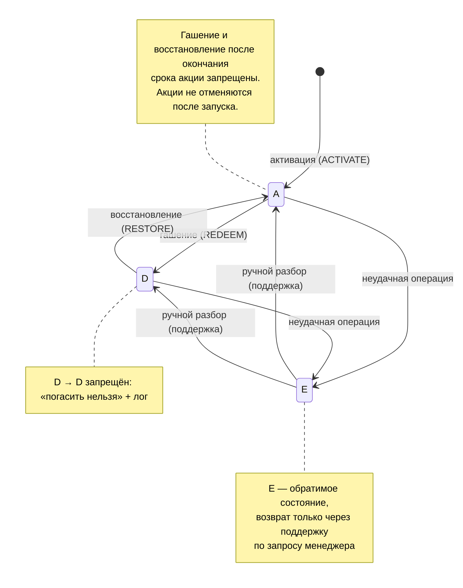

# Диаграмма жизненного цикла купона

```mermaid
stateDiagram-v2
    [*] --> A: активация (ACTIVATE)
    A --> D: гашение (REDEEM)
    D --> A: восстановление (RESTORE)
    A --> E: неудачная операция
    D --> E: неудачная операция
    E --> A: ручной разбор (поддержка)
    E --> D: ручной разбор (поддержка)

    note right of E
        E — обратимое состояние,
        возврат только через поддержку
        по запросу менеджера
    end note

    note right of D
        D → D запрещён: «погасить нельзя» + лог
    end note

    note left of A
        Гашение и восстановление после окончания
        срока акции запрещены.
        Акции не отменяются после запуска.
    end note
```
